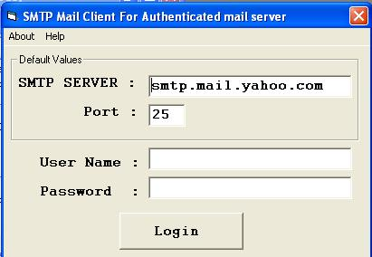



## Smtp mail client for authenticated mail server \(yahoo\)

### Description

This code is written to connect with yahoo SMTP mail server and then send mail with the help of SMTP server.Comments abt the program are welcomed

This doesn't works for free service. But in case of id ends with "co.in" is working well including free service.
 
### More Info
 
This is used because login to yahoo using website takes some time to send every mail. This is simple and quick application that sends email to any mail address with the help of your yahoo id(not full mail address only use id)

You can also used to send anonymous mail with the fake email id

Error Occurs.

Some the errors occur due to the base64 conversion of your username and password. So if such error available then try with another user id and password.

The base64 conversion part is not mine. I have download the code for base64 conversion from internet.

             |
---                |---
**Submitted On**   |2005-05-10 21:50:50
**By**             |[Antany Vasanth L](https://github.com/Planet-Source-Code/PSCIndex/blob/master/ByAuthor/antany-vasanth-l.md)
**Level**          |Beginner
**User Rating**    |5.0 (20 globes from 4 users)
**Compatibility**  |VB 6\.0
**Category**       |[Internet/ HTML](https://github.com/Planet-Source-Code/PSCIndex/blob/master/ByCategory/internet-html__1-34.md)
**World**          |[Visual Basic](https://github.com/Planet-Source-Code/PSCIndex/blob/master/ByWorld/visual-basic.md)
**Archive File**   |[Smtp\_mail\_1886495102005\.zip](https://github.com/Planet-Source-Code/antany-vasanth-l-smtp-mail-client-for-authenticated-mail-server-yahoo__1-60454/archive/master.zip)

